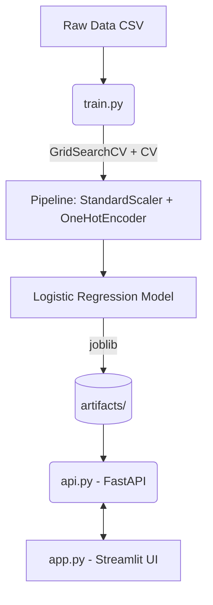

# Customer Churn Prediction System

A complete machine learning application that predicts customer churn using a trained model served via a FastAPI REST endpoint and an interactive Streamlit frontend.

## 🚀 Architecture



## 🛠️ Tech Stack
- **Python 3.10+**
- **Scikit-learn**: Machine learning pipeline (Preprocessing, Logistic Regression, GridSearchCV)
- **FastAPI**: Asynchronous REST API
- **Pydantic**: Robust schema validation
- **Streamlit**: Interactive user interface
- **Pandas**: Data manipulation

## ✨ Key Features & Engineering Decisions

1. **Robust Preprocessing Pipeline**: Uses `ColumnTransformer` to handle both numeric and categorical features within a single Scikit-learn `Pipeline`. This prevents data leakage and simplifies inference.
2. **Hyperparameter Tuning**: Implements `GridSearchCV` with k-fold cross-validation to find the optimal Logistic Regression parameters (`C` and `solver`), evaluated via F1-score.
3. **Comprehensive Metrics**: Evaluates hold-out performance using Accuracy, F1 Score, ROC-AUC, and Confusion Matrices to fully understand the imbalanced class nature of churn.
4. **Strong Typing & Validation**: Pydantic `Literal` types strictly validate API inputs (e.g., rejecting invalid categories) before they reach the model.
5. **Observability**: FastAPI middleware injects a unique `X-Request-ID` into every request for tracing.
6. **Centralized Configuration**: All paths, hyperparams, and feature definitions live in `config.py`.

## 📦 Setup & Installation

```bash
# Clone the repository
git clone https://github.com/UdayPatnala/churn-prediction-system.git
cd churn-prediction-system

# Create virtual environment (optional but recommended)
python -m venv venv
source venv/bin/activate  # On Windows: venv\Scripts\activate

# Install dependencies
pip install -r requirements.txt
```

## 🏃‍♂️ Running the System

### 1. Train the Model
You must train the model before running the API or UI.
```bash
python src/train.py
```
*This validates the data, trains the model, and saves `churn_model.joblib` and `metrics.json` to the `artifacts/` folder.*

### 2. Start the API
```bash
uvicorn src.api:app --reload --port 8000
```

### 3. Start the UI (in a new terminal)
```bash
streamlit run app.py
```

## 🧪 Testing the API directly

You can access the auto-generated Swagger UI at `http://localhost:8000/docs` or use `curl`:

**Check Health:**
```bash
curl http://localhost:8000/health
```

**Make a Prediction:**
```bash
curl -X 'POST' \
  'http://localhost:8000/predict' \
  -H 'Content-Type: application/json' \
  -d '{
  "tenure": 12,
  "monthly_charges": 89.9,
  "total_charges": 1078.8,
  "contract": "Month-to-month",
  "has_internet": "Yes",
  "has_phone": "Yes",
  "support_tickets": 2
}'
```

## 📝 License
MIT License
